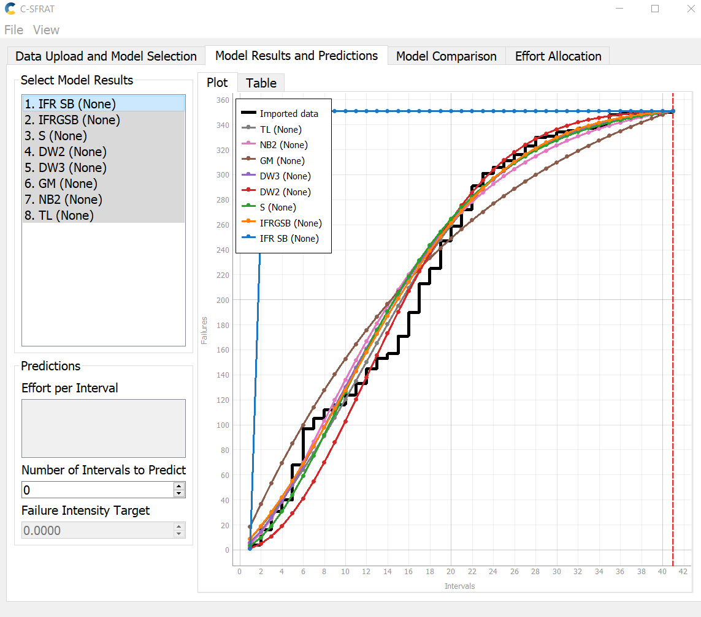
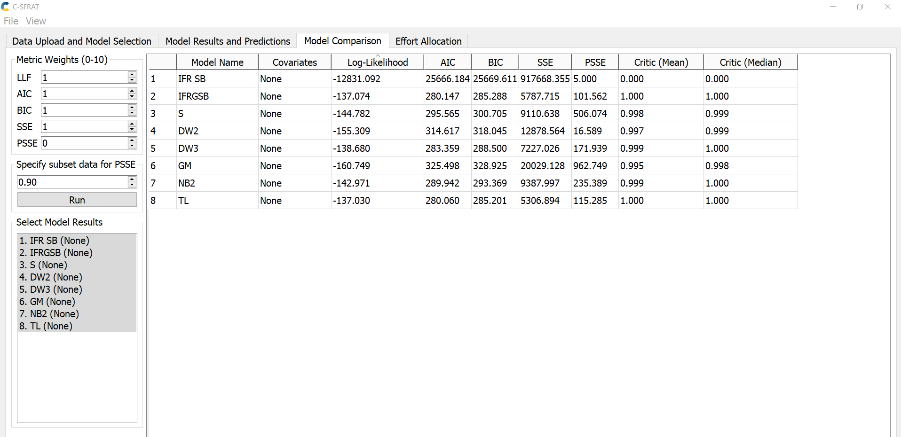
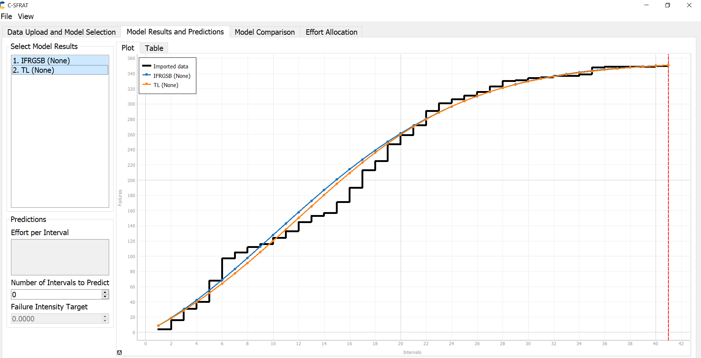
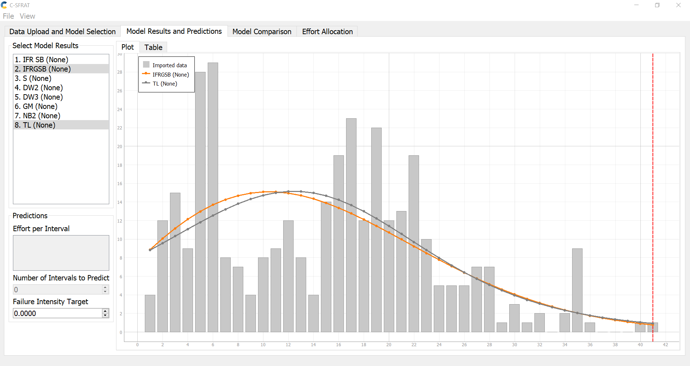
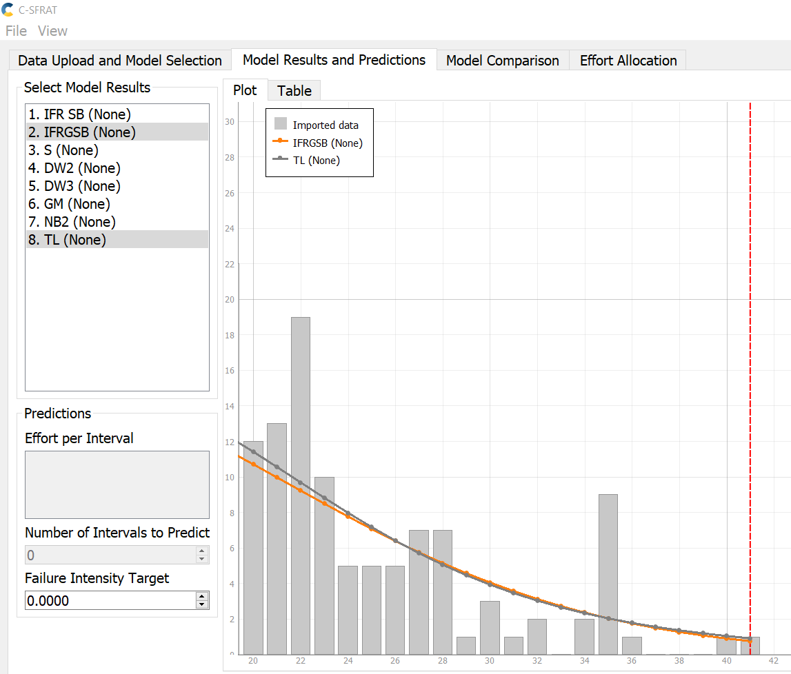
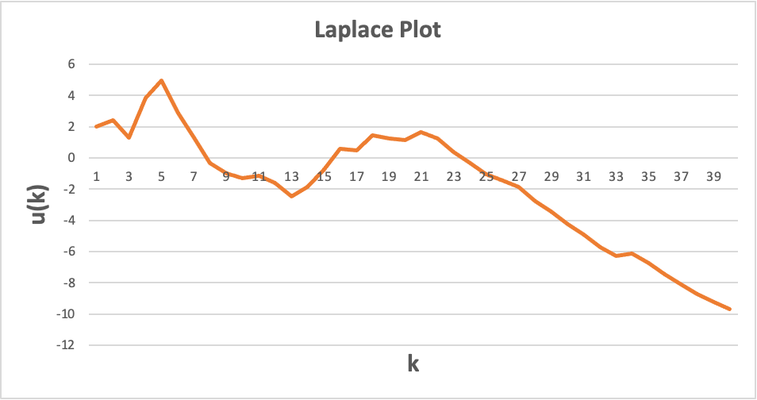
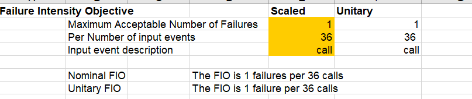
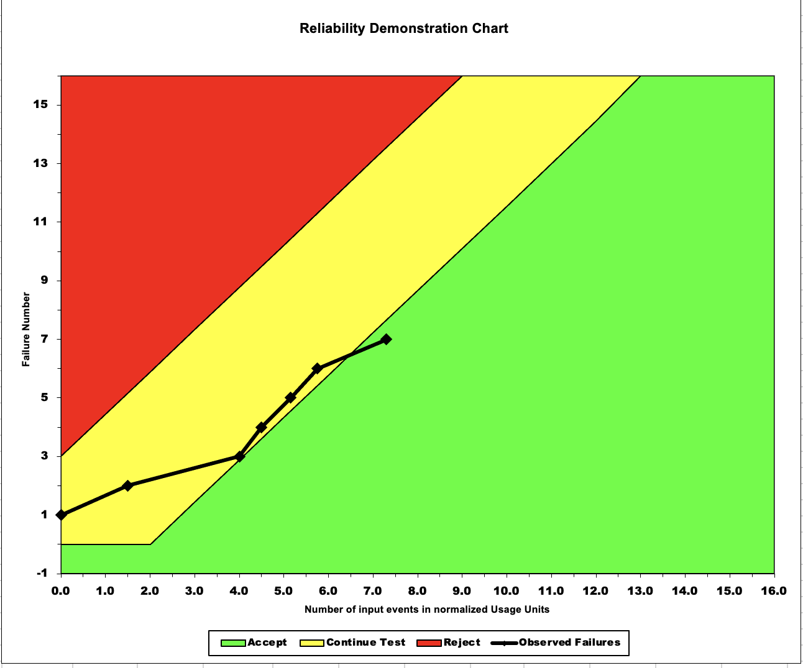
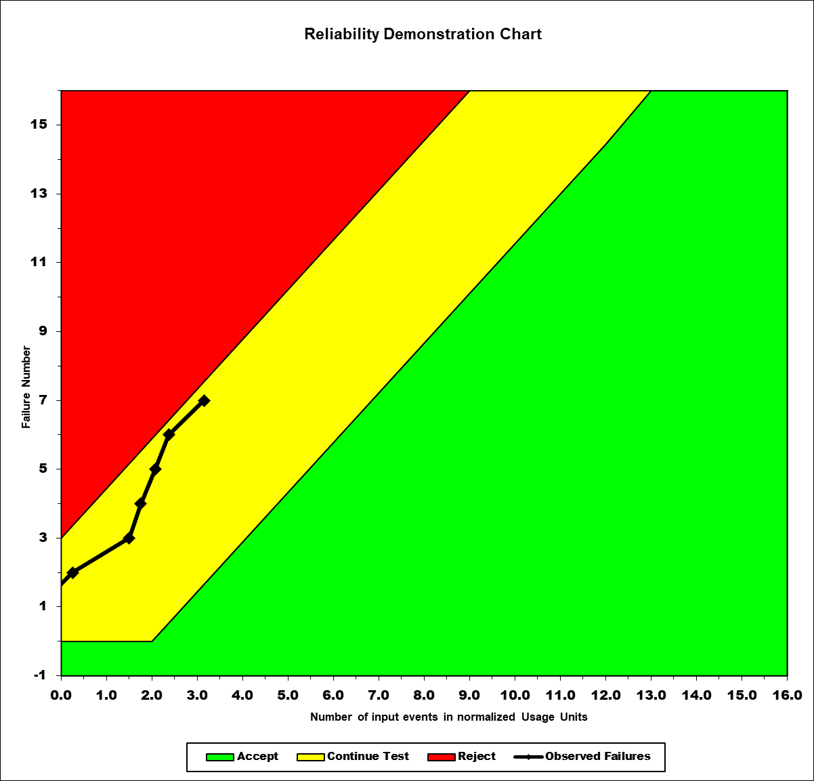
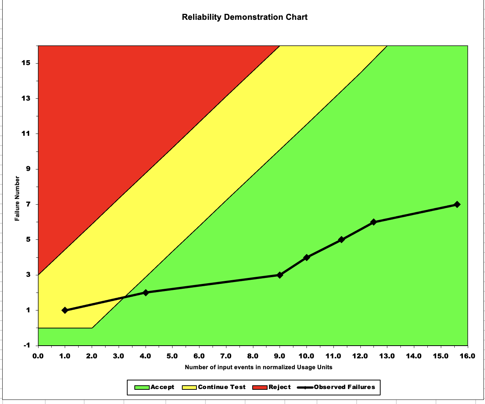

**SENG 438- Software Testing, Reliability, and Quality**

**Lab. Report \#5 – Software Reliability Assessment**

| Group \#:  22     |   |
|-----------------|---|
| Caroline                |   |
|  Dhyey  |   |
| Fanny                |   |
| Sukriti                |   |

# Introduction
In this assignment, we are exploring system reliability using reliability growth testing and analyzing the reliability demonstration chart (RDC). Reliability growth testing is a method used to assess the reliability of a system through testing and analysis. The reliability demonstration chart (RDC) is a tool used to track the performance of a system over time. RDC plots the reliability of a system against the number of test units (normalized to MTTFs) to visualize the system’s performance and reliability growth over time. 

# Assessment Using Reliability Growth Testing 
Using C-SFRAT, we plotted out the failure count data for CDS.DAT. We modelled the curve using all models available for C-SFRAT, the overlapping curve for all models is shown in Figure 1, and the relevant metrics on data fit is shown in Figure 2.

**Figure 1:Plot of all models using C-SFRAT comparing them against imported data.**

In order to determine the top two models that best fit our data, we used AIC (Akaike Information Criterion) to evaluate. The two models we chose are IFRGSB (IFR generalized Salvia & Bollinger) and TL (Truncated Logistic) because they have the smallest AIC amongst the models, with 280.147 and 280.060, respectively (figures 2 & 3).

**Figure 2:Specific metrics obtained by each model.**

**Figure 3:Reliability growth for IFR generalized Salvia & Bollinger and Truncated Logistic models.**

With these two models, we plotted the failure intensity graph, shown in Figure 4 below. We kept the failure intensity target at 0.000 as the produced graph was clear enough without adjusting the intensity target. 

**Figure 4: Failure intensity graph for IFR generalized Salvia & Bollinger and Truncated Logistic models.**

In order to determine the useful range of data, we need to examine the failure intensity chart. The useful range of data starts when we observe a decline in failure intensity over time, because this is when the system removes failure the moment it’s discovered. The useful range is between 20 to 41, which is shown in Figure 5.

**Figure 5: Modified failure intensity chart to show the useful range of data for the chosen models.**

We also calculated the laplace factor u(k) to determine the failure intensity and reliability trend, shown in Figure 6 using the laplace test statistic $u(k)=\frac{\sum_{i=1}^k(i-1)n(i)-\frac{k-1}{2}\sum_{i=1}^kn(i)}{\sqrt{\frac{k^2-1}{12}\sum_{i=1}^{k}n(i)}}$ . Starting from k = 21, which is the start of our useful range determined earlier, we see a steady decrease in laplace factor. A decrease in laplace factor signifies decreasing failure intensity and therefore reliability growth.

**Figure 6: Laplace plot to calculate failure intensity and reliability trend.**

# Assessment Using Reliability Demonstration Chart 

For this portion, we used the data from Failure Report 3.docx. We estimated our MTTFmin to be 36 by trial and error (Figure 7) to find the minimum number of events it takes for the data to reach the accepted (green) region of the RDC graph (Figure 8). Once it hits those criteria, we know that this will be the mean time to failure for our dataset. We then multiplied our MTTF value by 2 to get twice the MTTF (Figure 9). This showed us that when the MTTF is twice, the data switched to the re-test region (yellow), to indicate that we require more testing. When we divided our estimated MTTF by 2, we noticed that our data goes into the rejected region of the RDC chart (red), to indicate that when the mean time to failure is small, there will be more errors encountered, due to fewer testing, and thus resulted in more bugs in the system (Figure 10).

**Figure 7: Failure intensity objective showing how the MTTF of 36 using trial and error.**
 
**Figure 8: RDC chart showing data behaviour with estimated MTTF value.**

**Figure 9: RDC chart showing data behaviour with double the MTTF value.**

**Figure 10: RDC chart showing data behaviour with halved the MTTF value.**

# A discussion on the advantages and disadvantages of RDC
Advantages: 
- It is pretty fast to use and requires little time and minimal data input from the user (you just need to input the failure data)
- The visuals are easy to understand, for example the 3 color range of red,green and yellow make it clear for us to spot the failures
- Through the visual representation, it’s simplified to spot trends and predict overall software behaviour. This makes it easy to model and communicate issues in the system

Disadvantages:
- It does not tell you why the failures occurred, which could be difficult for debugging and determining trends on which specific part of a system is being problematic
- You need a minimum amount of data for the RDC to prove useful, if a system is brand new and doesn’t have much failure data, RDC wouldn’t be able to provide much value.
- It does not provide any numerical data for reliability and only provides a graph that shows whether the system is reliable or not. 

# Comparison of Results
Based on the failure data provided, our reliability growth analysis and reliability demonstration chart have concluded that our system is reliable. After determining our useful range of data, we see that the failure intensity plot and the laplace plot suggests that the system has increased reliability and decreased failure rate. Similarly, part two (RDC) exhibits data initially shifting from the “continue testing” phase to the “acceptable” phase. However, we believe that the results of part 1 are to be more precise, as we use mathematical models and the laplace test to verify our findings. Having said that, RDC provided a more visual representation using a trial and error approach to find the MTTFmin. Nonetheless, analyzing the overall trend of the system and comparing the results from our findings, the SUT is shown to be stable.

# Discussion on Similarity and Differences of the Two Techniques
Reliability growth analysis (using C-SFRAT) and RDC are both techniques to assess the reliability of a system. Both techniques require data failure to calculate reliability metrics. Reliability growth analysis can be based on inter-failure times and/or failure count and target failure rate. For this lab, we used the failure count data to complete our C-SFRAT portion to determine the failure intensity plot. RDC is based on inter-failure times only and target failure rate.

Reliability growth analysis determines the growth of reliability by identifying buys in the system in the development phase. As the bugs are identified and removed, the reliability of the system increases. This can be shown in our failure intensity plot and the laplace plot, where as time goes on, failure intensity and laplace factor decreases. Therefore reliability growth analysis is a continuous process. For RDC, we used Failure Report 3.docx, which details the time-between failure data. RDC is a reactive approach that uses a sample of units to demonstrate that a certain level of reliability has been achieved. 

Both reliability growth analysis and RDC are useful tools to evaluate the reliability and provide a more complete picture of the reliability of a system. 

# How the team work/effort was divided and managed
The work was distributed evenly throughout the team and each task was then discussed with the rest of the team so everyone can have an equal understanding of the task. C-SFRAT efforts were carried out by Sukriti and Caroline and RDC efforts were done by Fanny and Dhyey. We had regular meetings to discuss what we’ve learned and any issues we were facing. Some team members use Macbooks where they ran into issues running some of the programs. In this case, the team came together to aid the other members by sharing computers so that everyone gets a chance to see how all parts of the lab work.

# Difficulties encountered, challenges overcome, and lessons learned
This lab gave us the opportunity to explore the various methods of testing software reliability, such as reliability growth testing and reliability demonstration chart. These two methods gave us different perspectives on how to assess the reliability of a system. The most challenging part of the lab is the tools we were asked to use. There is a steep learning curve in learning how to use the tools properly, and for selective tools our group had device compatibility issues resulting in not able to run the executables of certain programs. 

In addition, the RDC excel file has a lot of variables and values that aren’t explained in-depth, making it fairly difficult to understand which parameter we are allowed to manipulate and change.  While exploring the RDC tool, our group had to use a lot of trial-and-error to determine the appropriate MTTF value.

# Comments/feedback on the lab itself
We suggest if this lab is run again for future students, they can benefit greatly from a more in-depth lab documentation and video walkthrough of the tools presented in the lab. In addition, if there are more updated reliability tools that have a more user-friendly interface, it may remove the device compatibility issues that some students experienced. Lastly, we were given a lot of failure data in the repository, and perhaps reducing the number of files given can better help students understand the requirements of this lab.
